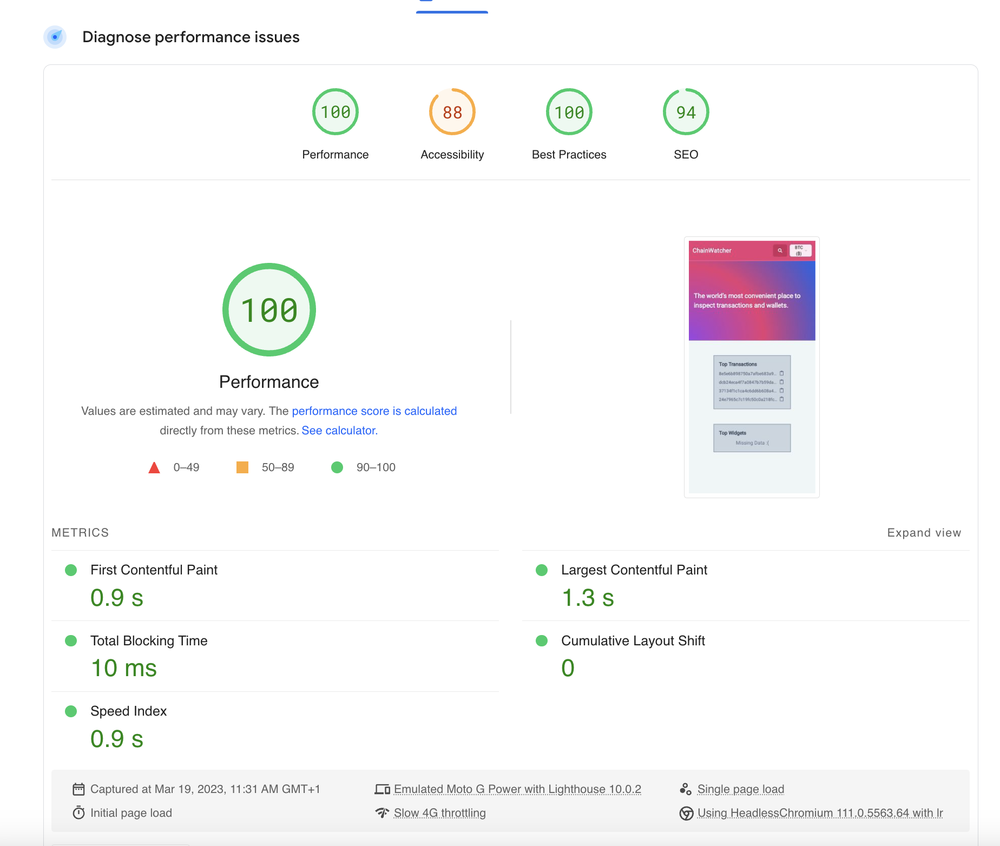

# ChainWatcher

Hi! I have created this project which is available publicly via [this link](https://chainwatcher-gilt.vercel.app/).

It uses the following technologies to combine the requested features:

- NextJS 13.2 as **React** Meta-framework (We're using the brand new app directory)
- **Prisma** (& **Planetscale**) as database for storing views for hashes (useful for widgets)
- **Vercel** as hosting solution, it was chosen due to simplicity of deploying and having CDN and SSR solution out of the box.
- Storybook 7 (RC) is used to view & document shared components in the sites. Some JEST tests are made for visual testing via Storybook interactions.
- Cypress 12 is used for E2E tests.
- Tailwind / **Shadcn** / RadixUI were used for styling of the components. Please note that components in `./components/ui` were provided by [Shadcn Docs](https://ui.shadcn.com/docs)
- Zod ❤️, a small library that converts `unknown` to fully typed definitions. When receiving input from users, zod is a must.
- **Prettier** / **Eslint** to ensure consistent code style across the whole project. This is even especially useful with more contributors.
- Usage of **localstorage** for storing state required for notifications. This ensures that data is not lost after reload.
- Usage of **cookie** for currencies, the perfect data source that can be used across browser and server.
- Somethig I am really proud of, is low bundle size for each page. It adds up to around 90kb for each page. The true power of doing everything on the server.
- Of course due to low bundle size, we got a performance score of 100 in PageSpeed test below:



# Project Requirements

Projects requirements were given via a PDF file, I extracted them into below list:

## Features

- [x] Use ReactJS
- [x] retrieves address and transaction information from the BTC blockchain.
- [x] It also allows a user to subscribe for changes to specific hashes.
- [x] Each subscribed hash should generate a notification on the UI.
- [x] Furthermore, the user should be able to select in which currency the values should be displayed (USD, EUR or BTC).

## Deliverables

- [x] Solution code
- [x] Tests
- [x] Documentation to set up / run / test the project
- [x] Upload to GitHub

## Questions

- [x] Logic and code complexity - How easy will my code be for it to be maintained by someone else? Am I using good practices and proper design patterns?
- [x] Test coverage - Is my code tested? Are all scenarios considered?
- [x] Requirement coverage - Is the application doing what it is meant to be doing?

## Issues

While working on the project, some small parts of the requirements were a bit unclear to me:

- I had trouble understanding what “Total BTC unspent” means in the context of an address. I am currently returning the balance as part of the value.
- Triggering notifications for hash changes can become very expensive in terms of API consumptions, therefore it was limited to 3 addresses and 3 transactions.

## Possible Improvements

The project was very interesting, and even though I have worked in a Web3 project (mainly covering ETH), I haven't focused that much on details such as confirmations.

I felt like working on all below improvements, however that would go beyond the 10h limit we have set 😭

### General improvements

- When tracking page views we are trusting user input (hash). Ideally this is sanitised before this is included in database.
- The application supports **3+3 subscriptions** (per client) for notifications to ensure limited use of Blockchain API. This feature is quite costly, a shared caching mechanism could possibly help to increase the amount of subscriptions per client.
- More Unit tests (especially for all utils).
- Individual components are mostly made for specific container sizes. Usage of container queries would allow them to be used in multiple websites.
- No use of Design System, so some components are themed under various colours made specifically for this website. These components might not look as good if had to be re-used on other sites.
- Use **websockets** for notifications instead of polling system.

### Testing improvements

Not all pages, components are covered with tests. With more time this could be improved 👍

- The 3 pages under **/apps** directory can't be tested as they functions they are exporting are async, and that is not yet supported with storybook. That is probably a tradeoff when using something in Beta 😭
- The UI components from **Shadcn** were not covered with tests due to their simplicity. These however can be viewed in storybook 😍

# Setting up locally

## Environment variables

You will be given environment variables, which you need to set in `.env` file of root directory. Without these variables the application might not work as expected.

If not access is given, set these values manualy:

**DATABASE_URL**="Prisma compatible URL (use PlanetScale or local database)"
**CHAIRGATE_TOKEN**="ChairGate API token"

## Install dependencies

```bash
npm install
```

## Run website locally

```bash
npm run dev
```

## Run production build

```bash
npm run build
npm run start
```

## Run e2e tests locally

```bash
npm run dev
npm run e2e
```

## Run component tests

```bash
npm run storybook:build
npm run storybook:test:ci
```
